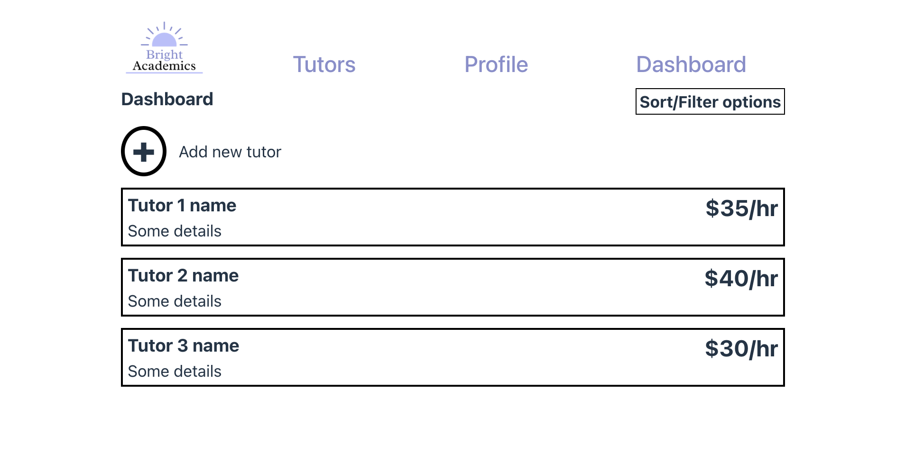

<h1 style="text-align:center">T3A2-Full-Stack-App</h1>

<h2 style="text-align:center">Table of Contents</h2>

- [Purpose](#purpose)
- [Functionality / Features](#Features)
- [Target Audience](#audience)
- [Tech Stack](#stack)
- [Dataflow Diagram](#dataflow_diagram)
- [Application Architecture Diagram](#aad)
- [Wireframes](#wireframes)
- [Trello](#trello)

<h2 style="text-align:center"> R1 Description of Web Application</h2>

<h2 style="text-align:center" id="purpose">Purpose</h2>

Our client is a local small business, named Bright Academics who specialises in providing tutoring services to individuals at all levels of their education journey, however, they have a definite focus on individuals who are sitting their HSC or equivalent. Due to an increase in both the number of tutors who are employed, as well as an increase in clients, Bright Academics is in need of a full fledged web application which provides usefulness to both clients and admins through the same web application. This web application will provide ease of use and allow for business processes for Bright Academics to be enhanced and improved.

## <h2 style="text-align:center" id="Features">Functionality / Features</h2>

At this point in time, the MVP for our web application has three main features. These include: User Authenication which will allow for user registration and login as well as profile management including password recovery, Tutor Listing which will provide clients with tutor resumes, the subjects which they teach, pricing and filter functionality to allow for efficient searching based on price and subjects taught, and finally, there will be an admin dashboard where users with the correct permissions will be able to manage employment records. On top of these features, there will be a small amount of stretch goal features which may be present at final submission. A key strech goal for the project includes the implementation of an online booking system which will allow clients to view real time availability of tutors and allow for easy booking/cancellation of sessions.

## <h2 style="text-align:center" id="audience">Target Audience</h2>

There are two key groups of individuals to which this web application will be appealing. This is of course the admin of Bright Academics who will be able to update tutor profiles on the application and manage employment records of tutors through the web application. Another key audience of this web application are prospective and current clients of Bright Academics who are interested in viewing the services/pricing which is offered. This will be a multi purpose app which is able to be utilised by both audiences, however the way they do so will be different in nature.

## <h2 style="text-align:center" id="stack">Tech Stack</h2>

In order to complete this web application, we will be utilsiing the MERN stack. This includes; MongoDB, Express, React and Node.JS. A description of each will be discussed below:

- MongoDB: A database management system which is considered to be a noSQL database. The data is stored in documents which further stored in collections. This will be uilised as the database for out web application.

- Express: Is a back-end web application which is utilised to create RESTful APIs inconjunction with Node.Js. It is lightweight and flexible in terms of its ability to route due to its use of middleware. Within this application, Express is being utilised to create the API.

- React: Is an extremely powerful JavaScript library which allows users to create dynamic and responsive front-ends for web applications. In our web application, it will be utilised to handle and maintain the front-end.

- Node.js: Is a cross platform, open source JavaScript runtime environment. It allows for and executes JavaScript code outside of the web broswer and in combination with Express, will be utilised to create and maintain the API.

## <h2 style="text-align:center" id="dataflow_diagram">R2 Dataflow Diagram</h2>

## <h2 style="text-align:center" id="aad">R3 Application Architecture Diagram</h2>

<h2 style="text-align:center">R4 User Stories</h2>

<h3 style="text-align:center" id="trello">Trello Board</h2>

We have decided to use a Trello board to for the project management, which will see us utilize Agile Methodology, with a focus on SCRUM.

Conventions Used:

- Each feature is an Epic identified by the labels provided to the user stories.
- Within each Epic each story is prioritized according to requirements of the feature
- A fourth label epic for cross-stories over the features.
- Columns for:
  - Backlog
  - To-Do
  - Blockers
  - Done

The following features make up our minimum viable product.

<h3>Feature: User Authentication</h3>

<h4>Epics</h4>

    [x] User Registration and Login
    [x] Profile Management including password recovery

---

        Story: User Registration

            Description:
                As new user, I want to register an account so that I can access the platform.

            Acceptance Criteria:
                1. User Can register with a valide email and password
                2. Password must meet best practices for security criteria
                3. Confirmation email is sent to user after registration

            Test Cases:
                1. Verify User can register with valid credentials
                2.Verify an error message is shown for invalid email formats.
                3. Verify password criteria enforcement
                4. Verify confirmation email is sent to user after registration
        Link:
        https://trello.com/c/tjuJ4cJB

---

        Story: User Login

            Description:
                As a registered user, I want to log in so that I can access my account.

            Acceptance Criteria:
                1. User can log in with a registered email and password.
                2. Incorrect login attempts display an error message.
                3. After successful login, the user is redirected to the dashboard.

            Test Cases:
                Verify user can log in with valid credentials.
                Verify an error message for incorrect credentials.
                Verify user is redirected to the dashboard after login.
        Link:
        https://trello.com/c/Fu77sCLd

---

        Story: Password Recovery

            Description:

                As a user, I want to recover my password if I forget it.

            Acceptance Criteria:

                1. User can request a password reset link.
                2. Password reset link is sent to the user’s registered email.
                3. User can reset the password using the link.

            Test Cases:

                1. Verify password reset request with a valid email.
                2. Verify password reset link is sent.
                3. Verify the user can set a new password.
        Link:
        https://trello.com/c/ymTLTmaE

---

        Story: Profile Update

            Description:
                As a user, I want to update my profile information.

            Acceptance Criteria:
                1. User can update personal details such as name, email, and phone number.
                2. User can change their password.
                3. User changes are saved and reflected in the respective profile.

            Test Cases:
                1. Verify user can update profile details.
                2. Verify changes are saved correctly.
                3. Verify password change functionality.
        Link:
        https://trello.com/c/VZjvga0a

---

<h3>Feature: Tutor Listing</h3>

<h4>Epics</h4>

    [x] Tutor Resume
    [x] Subjects List
    [x] Pricing
    [x] Search and filter functionality by tutor
    [x] Search and filter functionality by subject
    [x] Search and filter functionality by price

---

        Story: Tutor List

            Description:

                As a user, I want to view a list of available tutors.

            Acceptance Criteria:

                1. Tutors are displayed with key details (name, subjects, pricing).
                2. List is paginated (if dataset is large enough).

            Test Cases:

                1. Verify user can view tutor’s detailed profile.
                2. Verify subjects and qualifications are displayed correctly.

        Link:
        https://trello.com/c/3fMwBwCO

---

        Story: Subject and Pricing Information

            Description:

                As a user, I want to view the subjects and pricing for each tutor.

            Acceptance Criteria:

                1. Subjects offered by tutors are listed with their respective pricing.
                2. Users can view pricing for different subjects.

            Test Cases:

                1. Verify subjects are listed with correct pricing.
                2. Verify pricing information is accurate.

        Link:
        https://trello.com/c/uql5btlj

---

        Story: Search Tutors by Subject and Price

            Description:

                As a user, I want to search and filter tutors by subject and price.

            Acceptance Criteria:

                1. Users can search tutors by entering subject keywords.
                2. Users can filter search results by price range.

            Test Cases:

                1. Verify search functionality by subject.
                2. Verify filter functionality by price.
                3. Verify that the search results are accurate.

        Link:
        https://trello.com/c/70WbcBK3

---

        Story: View Tutor Profile

            Description:

                As a user, I want to view the detailed profile/resume of a tutor.

            Acceptance Criteria:

                1. User can view tutor's full profile, including experience and qualifications.
                2. User can see subjects taught by the tutor.

            Test Cases:

                1. Verify user can view tutor’s detailed profile.
                2. Verify subjects and qualifications are displayed correctly.

        Link:
        https://trello.com/c/qZ8lz0ML

---

<h3>Feature: Business Owner/Admin Dashboard</h3>

<h4>Epics</h4>

    [x] Management Employment Records
    [x] Admin/Overview of Site

---

        Story: Manage Employment Records

            Description:
                As an admin, I want to manage employment records for tutors.

            Acceptance Criteria:
                1. Admin can C.R.U.D. Records.
                2. All changes are logged accordingly.

            Test Cases:
                1. Verify admin can view employment records.
                2. Verify admin can add a new record.
                3. Verify admin can update existing records.
                4. Verify admin can delete records and that changes are logged.
        Link:
        https://trello.com/c/cdJOKUmP

<h2 style="text-align:center" id="wireframes">R5 Wireframes</h2>

### Tutors List

#### Desktop

Clicking on a tutor card opens a modal with more information

#### Mobile

On mobile the desktop navbar is replaced by a hamburger menu. The menu has been opened in the image below

The menu is closed and a modal is open in the image below

### Dashboard

#### Desktop

Admin users will see a dashboard link in the navbar. Signed in users, whether or not they are admins, will see the profile link in the navbar instead of sign up and login links

Similar to the view only tutors list, the dashboard also shows a modal when a card or the new tutor button is clicked

#### Mobile

### Login

#### Desktop

Image above shows a message that would be displayed after the user has inputed a valid email adress with an associated account and clicked the reset password button

Mobile version of this page is identical except for using a hamburger menu

### Sign up

#### Mobile

Desktop version looks identical but with full navbar

### Profile

#### Desktop

User is redirected to tutors list after pressing sign out button

Mobile version looks identical but with hamburger menu

####

<h2 style="text-align:center">R6 Trello Board</h2>

<a href="https://trello.com/b/wi2g4Wkf/full-stack-application" target="_blank">Trello Board - Full Stack Application</a>

---